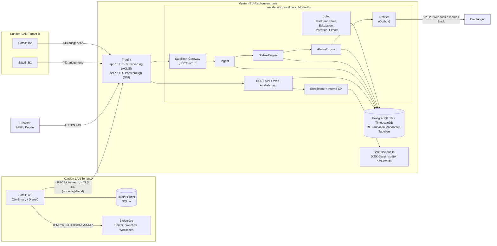
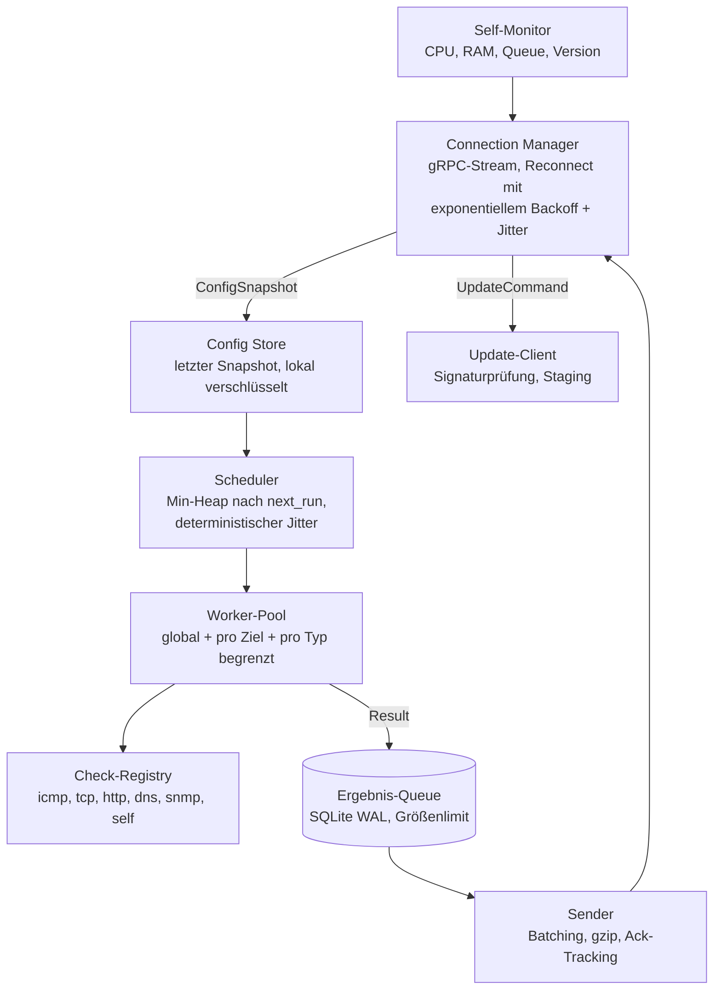
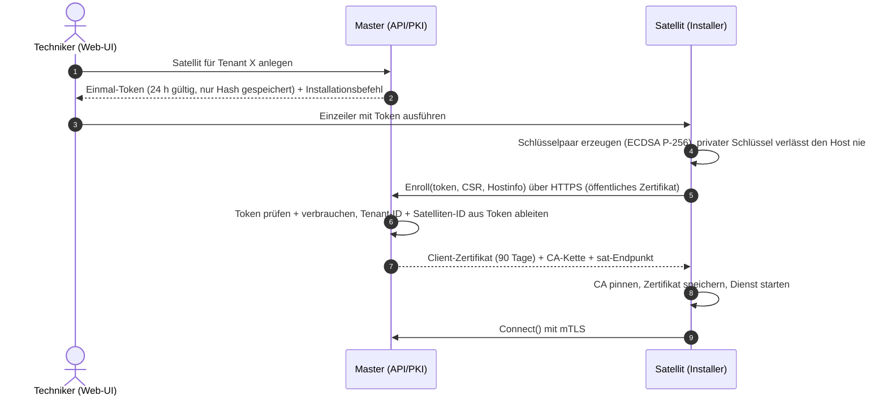
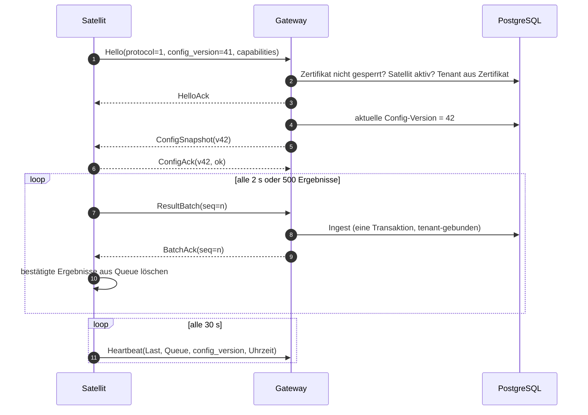
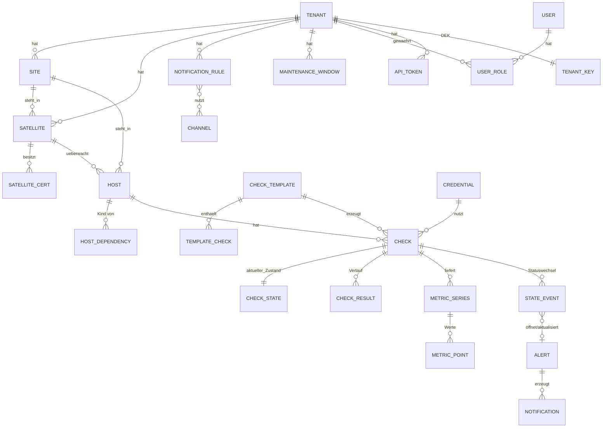
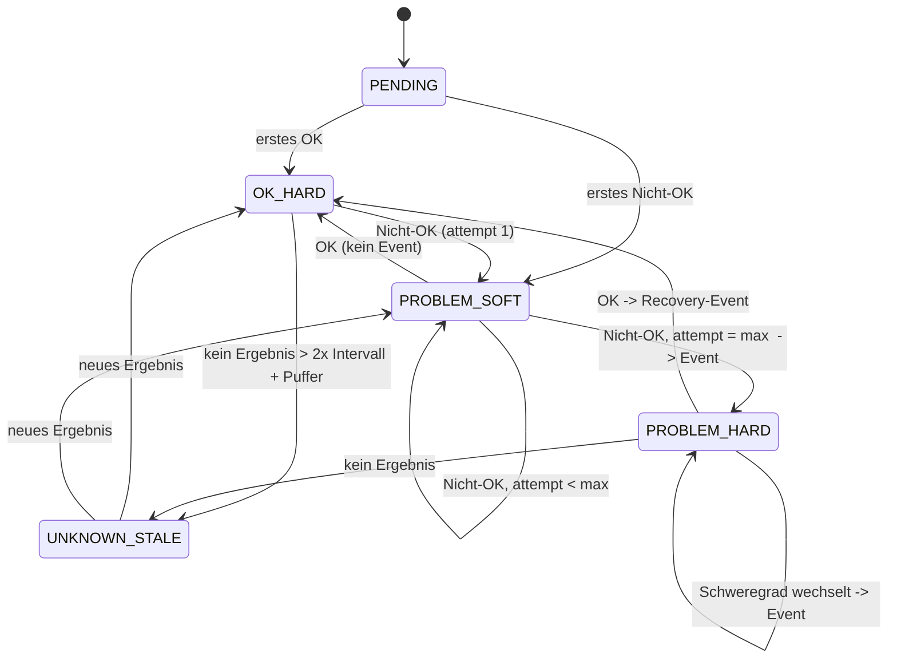

# Architektur: Mandantenfähiges Monitoring-System (Master/Satellit)

> **Status:** Freigegeben am 2026-09-27 (Arbeitsannahmen aus §16 gelten als bestätigt). Phase 1 ist umgesetzt.
> **Stand:** 2026-09-27
> Entscheidungen, die schwer rückgängig zu machen sind, stehen zusätzlich als ADR in [`docs/adr/`](adr/).
> Offene Fragen stehen in [Abschnitt 16](#16-offene-fragen-und-arbeitsannahmen). Bis zur Antwort gelten die dort genannten Arbeitsannahmen.

---

## Inhalt

1. [Ziele und Nicht-Ziele](#1-ziele-und-nicht-ziele)
2. [Systemüberblick](#2-systemüberblick)
3. [Master: Komponenten](#3-master-komponenten)
4. [Satellit: Komponenten](#4-satellit-komponenten)
5. [Protokoll Master ↔ Satellit](#5-protokoll-master--satellit)
6. [Sicherheit und Mandantentrennung](#6-sicherheit-und-mandantentrennung)
7. [Datenmodell](#7-datenmodell)
8. [Statusberechnung und Alarmierung](#8-statusberechnung-und-alarmierung)
9. [Mengengerüst, Skalierung, Engpässe](#9-mengengerüst-skalierung-engpässe)
10. [Betrieb](#10-betrieb)
11. [Repository-Struktur](#11-repository-struktur)
12. [Tech-Stack](#12-tech-stack)
13. [Risiken und Zielkonflikte](#13-risiken-und-zielkonflikte)
14. [Abweichungen von den Vorgaben](#14-abweichungen-von-den-vorgaben)
15. [Phasenplan](#15-phasenplan)
16. [Offene Fragen und Arbeitsannahmen](#16-offene-fragen-und-arbeitsannahmen)

---

## 1. Ziele und Nicht-Ziele

**Ziele v1**

- Zentraler Master (EU-Hosting) für beliebig viele Mandanten, bei jedem Mandanten ≥ 1 Satellit im LAN.
- Satellit führt Checks aus (ICMP, TCP, HTTP/S, DNS, SNMP v2c/v3, eigene Host-Metriken) und liefert nur Ergebnisse.
- Konfiguration, Auswertung, Alarmierung, Speicherung und UI ausschließlich auf dem Master.
- Nur ausgehende Verbindungen vom Satelliten, mTLS, Enrollment per Einmal-Token.
- Strikte Mandantentrennung auf DB-, API- und Protokoll-Ebene.

**Nicht-Ziele v1** (architektonisch vorbereitet, aber nicht gebaut)

- Remote-Aktionen, Patch-Management, Ticketing, Inventarisierung.
- Kunden-seitig selbst betriebener Master (On-Premises-Master), siehe Frage 1.
- Mehrere Master-Instanzen im Aktivbetrieb (vorbereitet, v1 läuft mit einer Instanz).
- SNMP-Traps und Syslog-Empfang (sind *eingehend* im Kunden-LAN, technisch möglich, aber nicht Teil von v1).

---

## 2. Systemüberblick



**Kernidee:** Der Satellit ist ein zustandsarmer Ausführer mit lokalem Gedächtnis nur für *Konfiguration* und *noch nicht bestätigte Ergebnisse*. Jede fachliche Entscheidung (Soft/Hard-State, Flapping, Abhängigkeiten, Wartung, Alarm, Benachrichtigung) trifft der Master.

---

## 3. Master: Komponenten

Der Master ist **ein Go-Binary** (`cmd/master`) mit klar getrennten internen Modulen (**modularer Monolith**, [ADR-0001](adr/0001-go-monorepo-modularer-monolith.md)). Per Flag/Env lassen sich Rollen einzeln aktivieren (`--roles=api,gateway,worker`), damit wir später ohne Umbau aufteilen können.

| Modul | Aufgabe | Zustand |
|---|---|---|
| `api` | REST-API (OpenAPI-spezifiziert) für Web-UI und Automatisierung, liefert gebautes Frontend aus | zustandslos, Sessions in PG |
| `enroll` + `pki` | Token-Prüfung, CSR signieren, Zertifikatserneuerung, Sperrung | CA-Schlüssel verschlüsselt, siehe §6 |
| `gateway` | gRPC-Server für Satelliten, mTLS, Stream-Verwaltung, Config-Push, Befehle | hält offene Streams (einziger „klebriger“ Zustand) |
| `ingest` | Ergebnis-Batches validieren, deduplizieren, per `COPY` in TimescaleDB schreiben | zustandslos |
| `eval` | Statusmaschine pro Check (Soft/Hard, Flapping, Stale), erzeugt Events | Zustand in `check_state` (PG) |
| `alert` | Events → Alarme (offen/bestätigt/gelöst), Deduplizierung, Abhängigkeiten, Wartung | PG |
| `notify` | Benachrichtigungsregeln, Kanäle als Plugins, Outbox mit Retry, Eskalation | PG-Outbox |
| `jobs` | periodische Aufgaben: Satelliten-Heartbeat, Stale-Erkennung, Eskalation, Retention, Export/Löschung | Leader über PG-Advisory-Lock bzw. `SKIP LOCKED`-Jobqueue |

**Koordination zwischen Instanzen (vorbereitet für >1 Instanz):**

- Jede Instanz trägt ihre aktiven Satelliten-Streams in `satellite_sessions (satellite_id, instance_id, connected_at)` ein.
- Konfigurationsänderung → `NOTIFY satellite_config, '<satellite_id>'`. Die Instanz, die den Stream hält, pusht.
- Verlorene Notifications sind unkritisch: Der Satellit meldet seine Config-Version im Heartbeat, der Master gleicht ab (Reconciliation alle 60 s). **Eventual Consistency statt verteilter Transaktion.**
- Periodische Jobs laufen über eine PG-Jobtabelle (`FOR UPDATE SKIP LOCKED`) bzw. Advisory Locks. NATS wird erst eingeführt, wenn LISTEN/NOTIFY messbar nicht reicht ([ADR-0008](adr/0008-koordination-postgres-first.md)).

---

## 4. Satellit: Komponenten



**Scheduler**

- Jeder Check hat `interval`, `timeout`, `retry_interval`.
- **Deterministischer Jitter:** Phasenversatz = `hash(check_id) mod interval`. Dadurch verteilen sich Checks gleichmäßig, und der Takt bleibt über Neustarts und Config-Updates stabil (keine Lastspitze bei jedem Push).
- Nach einem Nicht-OK-Ergebnis läuft der Check im `retry_interval` erneut, bis `max_attempts` erreicht sind. Das ist die einzige Zustandsinformation, die der Satellit pro Check hält (siehe [Abweichung A3](#14-abweichungen-von-den-vorgaben)).

**Worker-Pool**

- Globale Parallelität standardmäßig 256 (konfigurierbar vom Master).
- Pro Ziel-IP maximal 4 gleichzeitige Checks, damit schwache Geräte (z. B. SNMP auf Switches) nicht überlastet werden.
- Pro Check-Typ eigene Limits (ICMP, SNMP).
- 2.000 Checks/Minute ≈ 33 Checks/s. Bei 1 s mittlerer Dauer sind das ~33 gleichzeitige Worker. Das Ziel ist also mit großem Abstand erreichbar, Engpass sind eher Timeouts (siehe §9).

**Plugin-Schnittstelle (Skizze, nicht final)**

```go
type Checker interface {
    Type() string                                        // "http", "snmp", ...
    Validate(spec *pb.CheckSpec) error
    Run(ctx context.Context, spec *pb.CheckSpec, secrets SecretResolver) Result
}
// Registrierung beim Start: registry.Register(http.New())
// Der Satellit meldet beim Verbindungsaufbau die Liste unterstützter Typen (capabilities).
```

**Lokaler Puffer** ([ADR-0006](adr/0006-satellit-puffer-sqlite.md))

- SQLite (reines Go, `modernc.org/sqlite`, damit das Binary statisch ohne CGO bleibt), WAL-Modus.
- Tabellen: `results` (FIFO), `latest_result` (letztes Ergebnis je Check), `config` (verschlüsselter Snapshot), `meta`.
- Limit standardmäßig 500 MB bzw. 7 Tage. Bei Überschreitung werden die **ältesten Rohergebnisse** verworfen, `latest_result` bleibt immer erhalten. Verworfene Mengen werden gezählt und dem Master gemeldet (Lücke ist im UI sichtbar).
- Nach Reconnect sendet der Satellit **zuerst `latest_result`** (damit „unbekannt“ schnell verschwindet), danach die Historie in zeitlicher Reihenfolge mit Ratenbegrenzung.

**Lokale Secrets:** Der Config-Snapshot enthält Zugangsdaten. Er wird verschlüsselt gespeichert (Linux: Schlüssel aus Datei mit `0600`, Besitzer Dienstkonto; Windows: DPAPI Machine Scope). Das schützt vor versehentlicher Preisgabe, **nicht** vor einem Angreifer mit Root/Admin auf dem Satelliten-Host (siehe Risiko R3).

---

## 5. Protokoll Master ↔ Satellit

Details und Begründung: [ADR-0002](adr/0002-grpc-bidi-streaming-mtls.md).

### 5.1 Transport

- **gRPC über HTTP/2, TLS 1.3, Port 443**, ein langlebiger bidirektionaler Stream pro Satellit.
- Eigener Hostname `sat.<domain>`. Traefik reicht per **SNI-Passthrough** unverändert an den Master durch, **mTLS wird im Master-Prozess terminiert** (nicht im Reverse Proxy).
- gRPC-Keepalive alle 30 s, damit NAT/Firewalls die Verbindung nicht still schließen.
- Kompression: gzip auf Nachrichtenebene (gRPC-Standard). zstd ist später per Compressor-Registrierung nachrüstbar.
- Unterstützung für **explizite HTTP-Proxys (CONNECT)** über `HTTPS_PROXY`. TLS-aufbrechende Proxys sind mit mTLS nicht kompatibel und brauchen eine Ausnahme (Risiko R1).

### 5.2 Dienste (Entwurf `proto/monitoring/satellite/v1/`)

```protobuf
syntax = "proto3";
package monitoring.satellite.v1;

// Ohne Client-Zertifikat erreichbar (Server-TLS mit öffentlichem Zertifikat auf app.<domain>).
service EnrollmentService {
  rpc Enroll(EnrollRequest) returns (EnrollResponse);   // Token + CSR -> Zertifikat + CA-Kette
}

// Nur mit gültigem Client-Zertifikat (mTLS auf sat.<domain>).
service SatelliteService {
  rpc Connect(stream SatelliteMessage) returns (stream MasterMessage);
  rpc RenewCertificate(RenewRequest) returns (RenewResponse);
  rpc DownloadArtifact(ArtifactRequest) returns (stream ArtifactChunk); // Updates
}

message SatelliteMessage {
  oneof body {
    Hello           hello        = 1;  // protocol_version, agent_version, os/arch, capabilities, config_version
    Heartbeat       heartbeat    = 2;  // alle 30 s: Last, Queue-Tiefe, verworfene Ergebnisse, Uhrzeit
    ResultBatch     results      = 3;  // seq, repeated CheckResult
    ConfigAck       config_ack   = 4;  // version, ok/Fehler je Check
    CommandResult   command_res  = 5;
  }
}

message MasterMessage {
  oneof body {
    HelloAck        hello_ack    = 1;  // akzeptierte Protokollversion, Server-Zeit
    ConfigSnapshot  config       = 2;  // vollständige Konfiguration mit monotoner Version
    BatchAck        batch_ack    = 3;  // höchste bestätigte seq
    Command         command      = 4;  // RunCheckNow, Update, RotateCert, ... (geschlossene Liste)
  }
}

message CheckResult {
  bytes  result_id    = 1;   // ULID, vom Satelliten erzeugt -> Idempotenz
  string check_id     = 2;
  int64  config_version = 3;
  google.protobuf.Timestamp executed_at = 4;
  uint32 duration_ms  = 5;
  Status status       = 6;   // OK, WARNING, CRITICAL, UNKNOWN
  string message      = 7;   // gekürzt auf 1 KiB
  uint32 attempt      = 8;
  repeated Metric metrics = 9;  // name, value (double), unit
}

message CheckSpec {
  string check_id = 1;
  uint32 interval_s = 2; uint32 timeout_s = 3; uint32 retry_interval_s = 4; uint32 max_attempts = 5;
  string target = 6;
  repeated Threshold thresholds = 7;
  oneof spec { PingSpec ping = 10; TcpSpec tcp = 11; HttpSpec http = 12; DnsSpec dns = 13; SnmpSpec snmp = 14; SelfSpec self = 15; }
  repeated string secret_refs = 30;   // Verweise auf Secrets im selben Snapshot
}
```

### 5.3 Abläufe

**Enrollment**



**Laufender Betrieb**



### 5.4 Zustellgarantien

- **At-least-once** vom Satelliten zum Master: Ergebnisse bleiben in der Queue, bis `BatchAck` eintrifft.
- **Idempotenz** im Master über `(tenant_id, check_id, executed_at)` bzw. `result_id`. Doppelt gelieferte Batches werden verworfen.
- **Backpressure:** Maximal 4 unbestätigte Batches in Flug. Der Master kann über `HelloAck` Batchgröße und Rate vorgeben (Schutz vor Backfill-Sturm nach langem Ausfall).
- **Uhrzeitabweichung:** Der Master vergleicht die Satelliten-Uhrzeit im Heartbeat mit der eigenen. Ab > 30 s Abweichung gibt es eine Warnung am Satelliten. Gespeichert wird `executed_at` (Satellit) **und** `received_at` (Master).

### 5.5 Versionierung

- Protobuf-Paket `monitoring.satellite.v1`. Innerhalb von `v1` sind nur **additive** Änderungen erlaubt. Das prüft `buf breaking` in der CI gegen den Hauptzweig.
- Zusätzlich eine ganzzahlige `protocol_version` im `Hello` für Verhaltensänderungen ohne Schemabruch.
- **Garantie:** Master unterstützt `protocol_version` N und N-1. Ältere Satelliten bekommen im `HelloAck` den Hinweis „Update erforderlich“ und nur noch den Update-Befehl.
- Der Master sendet nur Check-Typen, die der Satellit in `capabilities` gemeldet hat. Andere Checks werden im UI als „vom Satelliten nicht unterstützt“ markiert.
- **Config als vollständiger Snapshot** statt Deltas ([ADR-0007](adr/0007-config-snapshots-versioniert.md)). Schätzung: 2.000 Checks ≈ 1 MB unkomprimiert, ≈ 100 KB gzip. Deltas erst bei Bedarf.

---

## 6. Sicherheit und Mandantentrennung

### 6.1 PKI ([ADR-0003](adr/0003-interne-ca-kurzlebige-zertifikate.md))

- **Zweistufig:** Offline-Root-CA (Schlüssel verschlüsselt offline gesichert) → Online-Intermediate „Satellite Issuing CA“ im Master (Schlüssel mit KEK verschlüsselt, siehe 6.4).
- **Client-Zertifikate:** ECDSA P-256, Laufzeit 90 Tage. Automatische Erneuerung über den Stream nach 1/3 der Laufzeit, also nach 30 Tagen.
- **Identität im Zertifikat:** `CN=<satellite_id>`, URI-SAN `urn:monitoring:tenant:<tenant_id>:satellite:<satellite_id>`.
- **Sperrung:** Keine CRL/OCSP-Infrastruktur. Da nur der Master Zertifikate prüft, gleicht er bei jedem Handshake die Seriennummer mit `satellite_certificates` ab (gecacht, 30 s TTL). Sperren im UI trennt aktive Streams sofort.
- **Satellit länger als 90 Tage offline** → Zertifikat abgelaufen → Neu-Enrollment nötig. Das ist bewusst so und dokumentiert.

### 6.2 Mandantentrennung: vier Ebenen

| Ebene | Mechanismus |
|---|---|
| **Protokoll** | Tenant- und Satelliten-ID kommen **ausschließlich aus dem geprüften Zertifikat**. Jede `check_id` in einem Batch muss dem **sendenden Satelliten** zugeordnet sein, nicht nur demselben Tenant. Fremde IDs werden verworfen und als Sicherheitsereignis geloggt. |
| **API** | Tenant-Kontext stammt aus Session bzw. API-Token. Pfadparameter wie `/tenants/{id}` werden nur *gegen* die erlaubte Menge geprüft, nie als Quelle der Berechtigung genutzt. |
| **Anwendung** | DB-Zugriffe laufen nur über `store.WithTenantScope(ctx, scope, fn)`: Transaktion + `SET LOCAL app.tenant_ids = '{...}'`. Ein Linter bzw. ein Architekturtest verbietet Pool-Zugriffe außerhalb davon. |
| **Datenbank** | Jede Mandanten-Tabelle hat `tenant_id NOT NULL`, `ENABLE` + `FORCE ROW LEVEL SECURITY`, Policy `tenant_id = ANY(current_setting('app.tenant_ids', true)::uuid[])`. Fehlt die Einstellung, ist das Ergebnis leer (**fail closed**). Fremdschlüssel sind zusammengesetzt, z. B. `(host_id, tenant_id) → hosts(id, tenant_id)`, damit sich Mandanten-übergreifende Referenzen nicht einmal anlegen lassen. |

**DB-Rollen**

- `mon_migrator`: Eigentümer des Schemas, nur für Migrationen.
- `mon_app`: Login-Rolle der Anwendung, **kein** `BYPASSRLS`, kein Eigentümer der Tabellen.
- `mon_system`: `BYPASSRLS`, nur für klar umrissene mandantenübergreifende Jobs (Heartbeat-Überwachung, Retention, Tenant-Löschung). Eigener Connection-Pool, eigener Code-Pfad, jede Nutzung ist im Code auffindbar.

**MSP-Sicht:** Ein Plattform-Admin bekommt als `app.tenant_ids` die Menge aller Tenants, ein beschränkter Techniker nur seine Tenants. Damit greift RLS **auch für MSP-Nutzer**. Es gibt keinen „Admin sieht alles“-Bypass im Request-Pfad.

**Pflichttests**

1. Ein Meta-Test liest `information_schema` aus und schlägt fehl, wenn eine Tabelle mit `tenant_id` keine erzwungene RLS-Policy hat.
2. Ein expliziter Test: Tenant A kann Daten von B über API und DB weder lesen noch schreiben, auch nicht mit gefälschten IDs in Pfad oder Body.
3. Ein Protokolltest: Satellit A sendet Ergebnisse mit `check_id` aus Tenant B → verworfen.

**TimescaleDB-Stolperstein 1 (in Phase 1 per Test gefunden):** Chunks erben die GRANTs der Hypertable, aber **nicht deren RLS**. Direkte Chunk-Abfragen würden die Mandantentrennung umgehen. Deshalb liegen Hypertables im Schema `ts` ohne Rechte für `mon_app`, und der Zugriff läuft über gleichnamige Views in `public` ([ADR-0010](adr/0010-hypertables-eigenes-schema.md)).

**TimescaleDB-Stolperstein 2:** Continuous Aggregates unterstützen **keine RLS**. Deshalb bekommt `mon_app` keinen direkten Zugriff darauf. Zugriff erfolgt nur über `security_barrier`-Views, die nach `app.tenant_ids` filtern. Das deckt ebenfalls ein Test ab (Risiko R2).

### 6.3 Benutzer und Authentifizierung

- **Rollen:** `platform_admin`, `msp_technician` (optional auf Tenants beschränkt), `tenant_admin`, `tenant_reader`. Zuordnung über `user_roles(user_id, role, tenant_id NULL = alle)`. Berechtigungen als feste Permission-Matrix im Code, getestet.
- **Passwörter:** Argon2id. **2FA:** TOTP (RFC 6238) mit Recovery-Codes. **OIDC:** Entra ID über `coreos/go-oidc`, vorbereitet über eine `IdentityProvider`-Schnittstelle.
- **Web-Sessions:** serverseitig in PostgreSQL (zustandslose Instanzen). Cookie `__Host-session` mit `HttpOnly`, `Secure`, `SameSite=Strict`, zusätzlich CSRF-Token-Header. **Keine JWTs im Browser**, weil sich Sessions sonst nicht sofort widerrufen lassen.
- **API-Tokens:** `mon_<id>_<secret>` mit 256 Bit Zufall. Gespeichert wird SHA-256 (bei dieser Entropie reicht das), jeder Token ist tenant-gebunden, hat Scopes und ein Ablaufdatum.
- **Audit-Log:** append-only (`mon_app` hat nur `INSERT`), mit Akteur, Zeit, IP, Aktion, Objekt, `before`/`after` als JSON. Secrets werden vor dem Schreiben maskiert.
- **Web-Härtung:** Rate Limiting (Login strikt, API pro Token), CSP ohne `unsafe-inline`, HSTS, `X-Content-Type-Options`, `Referrer-Policy`, `frame-ancestors 'none'`. Eingabevalidierung am OpenAPI-Schema plus fachlich. Der Logger hat einen Redaction-Filter für bekannte Secret-Felder.

### 6.4 Zugangsdaten: Envelope Encryption ([ADR-0005](adr/0005-envelope-encryption-crypto-shredding.md))

- **KEK** (Key Encryption Key) liegt **nicht in der DB**. In v1 kommt er aus einer eingehängten Datei/Secret. Die Schnittstelle `KeyProvider` erlaubt später Vault/KMS/HSM.
- **DEK pro Tenant** (AES-256-GCM), in der DB nur KEK-verschlüsselt gespeichert. Credentials werden mit dem DEK verschlüsselt (AAD = `tenant_id|credential_id`, damit sich Chiffrate nicht zwischen Datensätzen vertauschen lassen).
- **Crypto-Shredding:** Beim Löschen eines Tenants wird dessen DEK vernichtet. Dann sind Credentials auch in alten Backups nicht mehr lesbar (DSGVO).
- **Übertragung:** Entschlüsselt wird nur zum Bau des Config-Snapshots für genau den zuständigen Satelliten, übertragen nur im mTLS-Stream. Im UI sind Secrets **nur schreibbar**, nie wieder lesbar.
- **KEK-Rotation:** DEKs neu verpacken, Credentials bleiben unverändert.

### 6.5 Signierte Updates

- Release-Artefakte werden mit **Ed25519** signiert (Manifest mit SHA-256 je Artefakt). Der private Schlüssel ist **offline** oder im CI-Secret-Store mit Freigabe durch einen Menschen.
- Das Satelliten-Binary enthält 2 öffentliche Schlüssel (aktuell + nächster), damit sich Schlüssel rotieren lassen.
- Die Signatur wird **vor** jeder Installation geprüft. Ein Downgrade ist nur mit explizitem Flag im Befehl erlaubt.

---

## 7. Datenmodell

Alle IDs sind **UUIDv7** (zeitlich sortierbar, gut für Indizes). Alle Mandanten-Tabellen haben `tenant_id` und RLS.



### 7.1 Stammdaten (reguläre Tabellen)

| Tabelle | Wichtige Felder |
|---|---|
| `tenants` | `id, name, slug, status (active/suspended/deleting), retention_raw_days, retention_agg_days, customer_portal_enabled, settings jsonb` |
| `sites` | `id, tenant_id, name, timezone` |
| `satellites` | `id, tenant_id, site_id, name, status (pending/active/revoked), agent_version, protocol_version, os, arch, last_seen_at, config_version_desired, config_version_applied, update_channel` |
| `enrollment_tokens` | `id, tenant_id, satellite_id, token_hash, expires_at, used_at, created_by` |
| `satellite_certificates` | `serial, tenant_id, satellite_id, fingerprint, not_before, not_after, revoked_at` |
| `hosts` | `id, tenant_id, site_id, satellite_id, name, address, tags text[], host_check_id` |
| `host_dependencies` | `tenant_id, child_host_id, parent_host_id` (azyklisch, beim Speichern geprüft) |
| `check_templates` / `template_checks` | `tenant_id NULL = globale MSP-Vorlage`. Bei MSP-Vorlagen gilt eine eigene Policy: lesbar für alle, schreibbar nur für `platform_admin`. |
| `checks` | `id, tenant_id, host_id, template_id, type, spec jsonb (validiert gegen Proto-Schema), interval_s, timeout_s, retry_interval_s, max_attempts, thresholds jsonb, credential_id, enabled` |
| `credentials` | `id, tenant_id, kind, ciphertext, nonce, key_version` |
| `tenant_keys` | `tenant_id, wrapped_dek, kek_id, created_at, destroyed_at` |
| `config_versions` | `satellite_id, tenant_id, version bigint, sha256, created_at` (Version steigt bei jeder relevanten Änderung) |

**Vorlagen:** Beim Anwenden werden Checks **materialisiert** (`template_id` bleibt als Verweis). Änderungen an der Vorlage werden als „Vorlage aktualisieren → betroffene Checks neu erzeugen“ ausgerollt, mit Vorschau. Das ist einfacher und nachvollziehbarer als eine Laufzeit-Vererbung.

### 7.2 Zeitreihen (TimescaleDB-Hypertables) ([ADR-0004](adr/0004-postgres-timescaledb-rls.md), [ADR-0010](adr/0010-hypertables-eigenes-schema.md))

Physisch liegen alle Hypertables im Schema `ts`. Die Anwendung sieht sie nur über gleichnamige Views in `public`. Status-Werte in der DB entsprechen den Protobuf-Enum-Werten (1 = OK, 2 = WARNING, 3 = CRITICAL, 4 = UNKNOWN).

| Hypertable | Felder | Chunk / Kompression |
|---|---|---|
| `check_results` | `time, tenant_id, check_id, satellite_id, status smallint, duration_ms, attempt, message, received_at` | 1 Tag. Kompression nach 2 Tagen, `segmentby tenant_id, check_id` |
| `metric_points` | `time, tenant_id, series_id, value double` | 1 Tag. Kompression nach 2 Tagen, `segmentby series_id` |
| `state_events` | `time, tenant_id, check_id, from_status, to_status, state_type, reason` | 7 Tage |
| `audit_log` | `time, tenant_id NULL, actor, action, object, before, after, ip` | 30 Tage, nie automatisch gelöscht (Aufbewahrung konfigurierbar) |

- `metric_series (id bigserial, tenant_id, check_id, name, unit)`: Metriknamen werden normalisiert. Das spart Speicher und ist die Voraussetzung für gute Kompression.
- **Continuous Aggregates:** `metric_points_1h` (avg/min/max/count), `check_results_1h` (Verfügbarkeit in %). Zugriff nur über tenant-filternde Views (siehe 6.2).
- **Retention:** siehe Abweichung A4 und Frage 4.

### 7.3 Laufzeitzustand und Alarmierung

| Tabelle | Zweck |
|---|---|
| `check_state` | 1 Zeile pro Check: `soft_status, hard_status, state_type, attempt, last_result_at, last_change_at, flap_ring bit(20), is_flapping, output, in_downtime, acknowledged`. `fillfactor=70` für HOT-Updates. |
| `satellite_sessions` | wer hält welchen Stream (siehe §3) |
| `alerts` | `id, tenant_id, dedup_key, subject (host/check/satellite), severity, state (open/acknowledged/resolved), suppressed_reason (dependency/maintenance/null), opened_at, acked_by, acked_at, resolved_at, last_notified_at, escalation_level` |
| `notification_rules` | `tenant_id, match (severity, tags, hosts), time_windows, channels, escalation_steps jsonb` |
| `channels` | `tenant_id NULL = MSP-Kanal, type (email/webhook/teams/slack), config verschlüsselt` |
| `notification_outbox` | `alert_id, channel_id, payload, status, attempts, next_attempt_at` (Retry mit Backoff, garantiert „mindestens einmal“) |
| `maintenance_windows` | `tenant_id, scope (tenant/site/host/check), starts_at, ends_at, rrule NULL, reason, created_by` |
| `users`, `user_roles`, `sessions`, `api_tokens`, `jobs` | wie in §6.3 |

---

## 8. Statusberechnung und Alarmierung

Verantwortung ([ADR-0009](adr/0009-statusberechnung-aufteilung.md)):

- **Satellit:** Ein Ergebnis → Status, **zustandslos**, anhand der Schwellwerte aus der Config (z. B. RTT > 100 ms ⇒ WARNING). Kein Gedächtnis außer dem Wiederholungszähler für `retry_interval`.
- **Master:** alles mit Historie oder Kontext.

### 8.1 Zustandsmaschine pro Check



- **Flapping:** Ringpuffer der letzten 20 Zustände mit gewichteter Wechselrate (Nagios-Verfahren). Über 50 % gilt ein Check als flappend, unter 25 % nicht mehr (Hysterese). Solange er flappt: ein einziger Alarm „flappt“ statt vieler Wechsel.
- **Späte Ergebnisse** (nachgelieferter Puffer): Liegt `executed_at` vor `check_state.last_result_at`, geht das Ergebnis **nur in die Historie** und ändert weder Zustand noch löst es Alarme aus. Keine rückwirkenden Benachrichtigungen.

### 8.2 Satelliten-Überwachung (Self-Monitoring)

- Heartbeat alle 30 s. Stream-Abbruch ⇒ Satellit sofort „getrennt“ (nur Anzeige).
- Nach **Grace-Periode** (Standard 120 s, damit Master-Deployments und kurze Reconnects keinen Alarm auslösen) ⇒ „**offline**“ ⇒ **ein** Alarm `satellite_offline`, und alle Checks dieses Satelliten gehen auf `UNKNOWN` mit Grund `satellite_offline`. Das erzeugt **keine** Einzelalarme.
- Bei Wiederverbindung: Zustand aus `latest_result` aktualisieren, Offline-Alarm auflösen.
- **Master selbst:** Wer überwacht den Überwacher? Ein externer Dead-Man's-Switch (Heartbeat vom Master an einen unabhängigen Dienst in einem anderen RZ) alarmiert, wenn der Master schweigt (Risiko R10).

### 8.3 Abhängigkeiten und Deduplizierung

- Jeder Host hat einen **Host-Check** (meist Ping). Fällt er auf HARD CRITICAL und sind **alle Eltern** DOWN oder UNREACHABLE, wird der Host `UNREACHABLE`. Seine Alarme werden mit `suppressed_reason=dependency` angelegt, aber nicht benachrichtigt.
- **Zeitliche Unschärfe:** Das Kind kann vor dem Elternteil ausfallen, wenn der Router-Check später läuft. Lösung: Alarme mit Eltern werden **bis zu einem Intervall des Eltern-Host-Checks zurückgehalten** (Standard max. 60 s), und der Master stößt über `RunCheckNow` sofort einen Eltern-Check an. Das tauscht bis zu einer Minute Latenz gegen deutlich weniger Rauschen (Zielkonflikt Z2).
- **Deduplizierung** über `dedup_key = tenant|subject_type|subject_id|problem`. Pro Key gibt es höchstens einen offenen Alarm, weitere Events aktualisieren ihn.

### 8.4 Wartungsfenster

- Geplant (einmalig oder wiederkehrend per RRULE) und ad hoc („Host 2 h in Wartung“).
- Während der Wartung werden Ergebnisse normal gespeichert, Alarme mit `suppressed_reason=maintenance` angelegt und nicht benachrichtigt.
- Ist das Problem nach Fensterende noch da, wird **dann** benachrichtigt.

### 8.5 Benachrichtigung

- Regeln pro Tenant (Schweregrad, Tags, Hosts, Zeitfenster) → Kanäle. Dazu MSP-weite Regeln, z. B. „alle CRITICAL an MSP-Bereitschaft“.
- Kanäle als Plugin-Schnittstelle (`Notifier.Send(ctx, Notification) error`): E-Mail (SMTP), Webhook (JSON, HMAC-signiert), Teams (Workflows-Webhook), Slack (Incoming Webhook).
- **Eskalation:** Ein Job prüft offene, unbestätigte Alarme gegen `escalation_steps`, z. B. nach 15 min Stufe 2.
- Versand über **Outbox** mit Retry und Backoff. Ein fehlerhafter Kanal erzeugt einen Plattform-Alarm.

---

## 9. Mengengerüst, Skalierung, Engpässe

**Annahme** (siehe Frage 3): 50.000 Checks, mittleres Intervall 60 s, im Schnitt 2 Metriken pro Ergebnis.

| Größe | Wert |
|---|---|
| Ergebnisse | ≈ 830/s ≈ 72 Mio./Tag |
| Messpunkte | ≈ 1.700/s ≈ 144 Mio./Tag |
| Rohdaten unkomprimiert | ≈ 15–20 GB/Tag |
| Nach Kompression (typisch 10–20×) | ≈ 1–2 GB/Tag |
| 30 Tage Rohdaten | ≈ 50–80 GB inkl. der 2 unkomprimierten Tage |
| Stundenaggregate (1 Jahr, 100 k Serien) | ≈ 880 Mio. Zeilen, komprimiert ≈ 20–40 GB |
| Satelliten-Streams | 100, trivial |

Bei **5-Minuten-Intervallen** sinkt alles um den Faktor 5. Das Intervall ist der größte Kostentreiber.

**Engpässe und Gegenmaßnahmen**

1. **`check_state`-Updates (≈ 830/s):** Batch-Update pro Ergebnis-Batch (`UPDATE … FROM unnest(...)`), HOT-Updates dank `fillfactor`, kein Index auf häufig geänderten Spalten. Reicht für v1 deutlich. Später: Zustand im Speicher, partitioniert nach Satellit.
2. **Insert-Rate:** `COPY` in eine Staging-Tabelle, dann `INSERT … ON CONFLICT DO NOTHING`. Eine Transaktion pro Batch. Das trägt nach Erfahrungswerten 10.000+ Zeilen/s auf einer Instanz.
3. **Backfill-Sturm** nach Master-Ausfall: Alle 100 Satelliten liefern gleichzeitig Puffer nach. Dagegen hilft die Ratenbegrenzung pro Satellit (§5.4), und aktuelle Werte haben Vorrang.
4. **Reconnect-Sturm** nach Master-Neustart: exponentieller Backoff mit vollem Jitter auf Satellitenseite.
5. **Dashboards über lange Zeiträume:** automatisch auf `*_1h`-Aggregate umschalten, wenn der Zeitraum mehr als 48 h umfasst.
6. **Checks mit Timeouts auf dem Satelliten:** 2.000 Checks/min, bei denen im schlimmsten Fall 10 % in einen 10-s-Timeout laufen, belegen ≈ 33 Worker dauerhaft. Das ist mit 256 Workern unkritisch, wird aber als Metrik exportiert (`worker_saturation`).

**Horizontal später:** API und Ingest sind zustandslos. Das Gateway ist per Stream klebrig, aber jede Instanz kann jeden Satelliten bedienen (Load Balancer per L4). Der Evaluator muss bei mehreren Instanzen nach Satellit partitioniert werden, weil er Zustand pro Check im Batch schreibt. Das ist in v1 kein Thema, ist aber dokumentiert.

---

## 10. Betrieb

### 10.1 Deployment Master (v1)

`deploy/compose/`:

- `traefik`: ACME für `app.<domain>`, SNI-TCP-Passthrough für `sat.<domain>`.
- `master`: ein Container mit allen Rollen.
- `postgres`: `timescale/timescaledb:*-pg16`.
- **Nur Dev:** `satellite-dev` (enrollt sich automatisch mit geseedetem Token), `mailpit` (SMTP-Fänger), `demo-targets` (nginx, CoreDNS, snmpd-Simulator).

Kubernetes-fähig durch 12-Factor-Konfiguration (Env), Health-/Readiness-Endpunkte, keinen lokalen Zustand und Migrationen als eigenen Job (`master migrate`).

### 10.2 Beobachtbarkeit

- `log/slog` im JSON-Format mit `tenant_id`, `satellite_id`, `request_id`. Redaction-Filter für Secrets.
- `/metrics` (Prometheus): Ingest-Rate, Batch-Latenz, verbundene Satelliten, Outbox-Rückstau, DB-Pool, Evaluator-Verzug.
- `/healthz` (Liveness) und `/readyz` (DB erreichbar, Migrationen aktuell).
- Satelliten melden eigene Metriken im Heartbeat. Diese werden als Checks des Typs `self` gespeichert und sind im UI wie jeder andere Host sichtbar.

### 10.3 Backup und Restore (Konzept, Details in Phase 8)

- **Physisches Backup mit PITR:** pgBackRest (oder WAL-G) → S3-kompatibler Speicher in einem **zweiten EU-Rechenzentrum**. Täglich Vollbackup, WAL kontinuierlich, 14 Tage PITR.
- `pg_dump` nur ergänzend. Bei TimescaleDB sind dafür `timescaledb_pre_restore()`/`post_restore()` nötig, deshalb nicht der primäre Weg.
- **Schlüsselmaterial getrennt sichern:** KEK, CA-Schlüssel, Update-Signaturschlüssel. Ohne KEK sind Credentials verloren, ohne CA-Schlüssel müssen alle Satelliten neu enrollt werden.
- **Monatlicher Restore-Test** in eine Wegwerf-Umgebung, automatisiert und mit Protokoll.

### 10.4 Satelliten-Installation und Auto-Update

- **Linux:** `curl -fsSL https://app.<domain>/install.sh | sudo sh -s -- --token <TOKEN>`. Zusätzlich gibt es eine Variante mit vorher prüfbarer Prüfsumme. Das Skript legt einen Dienstbenutzer an, eine systemd-Unit mit `AmbientCapabilities=CAP_NET_RAW` (für ICMP) und Härtung (`ProtectSystem=strict` usw.).
- **Windows:** PowerShell-Einzeiler in v1, MSI (WiX) in Phase 8. Beides braucht **Authenticode-Signatur**, sonst blockieren SmartScreen oder Defender (Risiko R8).
- **Docker:** Image `ghcr.io/…/satellite` mit `NET_RAW`. **Kein Selbst-Update im Container.** Der Master zeigt nur „Update verfügbar“ an, aktualisiert wird über das Image-Tag (Abweichung A8).
- **Auto-Update (Binary-Installationen):** Ein kleiner, selten geänderter **Launcher** ist der eigentliche Dienst. Er startet die aktive Version aus `versions/<v>/`. Ablauf beim Update:
  1. Master schickt `Update(version)`.
  2. Satellit lädt das Artefakt über den mTLS-Stream und prüft die Signatur.
  3. Artefakt wird unter `versions/` abgelegt.
  4. Launcher startet die neue Version.
  5. Hat sie nach 5 min keine Verbindung plus Config-Ack → automatischer **Rollback** und Meldung an den Master.
- Rollout über **Kanäle** (`canary`, `stable`) und in Wellen (z. B. 10 % → 100 %) aus dem UI.

---

## 11. Repository-Struktur

```
.
├── CLAUDE.md
├── Makefile                  # zentrale Befehle (build, test, lint, gen, run)
├── go.mod                    # ein Go-Modul für Master + Satellit
├── buf.yaml / buf.gen.yaml
├── proto/monitoring/satellite/v1/*.proto
├── api/openapi.yaml          # REST-API-Vertrag (Quelle für Go-Server + TS-Client)
├── cmd/
│   ├── master/
│   ├── satellite/
│   └── satellite-launcher/
├── internal/
│   ├── master/{api,gateway,enroll,pki,ingest,eval,alert,notify,jobs,auth,audit,crypto}
│   ├── satellite/{conn,scheduler,worker,queue,config,selfmon,update}
│   ├── checks/{icmp,tcp,http,dns,snmp,self}   # Checker-Plugins + Registry
│   ├── store/                                 # DB-Zugriff (sqlc), WithTenantScope
│   ├── gen/                                   # generierter Code (proto, sqlc, openapi) – nie von Hand ändern
│   └── platform/{log,metrics,config,version}
├── migrations/               # goose, fortlaufend nummeriert, nie nachträglich ändern
├── web/                      # React + TS + Vite
├── deploy/{compose,docker,k8s,install}
├── test/{integration,e2e,load}
└── docs/{ARCHITECTURE.md,adr/,runbooks/}
```

---

## 12. Tech-Stack

| Bereich | Wahl | Begründung |
|---|---|---|
| Sprache Backend + Satellit | Go 1.25 | Wie vorgeschlagen: statische Binaries, geteilte Proto-Typen, ein Toolchain |
| RPC | `google.golang.org/grpc` | ausgereifter bidi-Streaming-Support, mTLS, Keepalive |
| Proto-Tooling | `buf` (lint, breaking, generate) | Rückwärtskompatibilität in der CI erzwingbar |
| REST | OpenAPI 3.1, `oapi-codegen` (Server), `openapi-typescript` + `openapi-fetch` (Client) | ein Vertrag, typsicher auf beiden Seiten |
| DB-Zugriff | `pgx/v5` + `sqlc` | typsicheres SQL ohne ORM, volle Kontrolle für RLS und `COPY` |
| Migrationen | `goose` | SQL-Migrationen, einbettbar ins Binary |
| Datenbank | PostgreSQL 16 + TimescaleDB 2.x | wie vorgeschlagen, Lizenzhinweis siehe R2 |
| Satelliten-Puffer | SQLite über `modernc.org/sqlite` | CGO-frei, flexibel, robust bei Stromausfall (WAL) |
| Checks | `prometheus-community/pro-bing`, `net/http`, `miekg/dns`, `gosnmp/gosnmp` | etabliert, gepflegt |
| Dienstintegration | `kardianos/service` | systemd + Windows-Dienst mit einer Codebasis |
| Frontend | React 19 + TypeScript 5.9 + Vite | wie vorgeschlagen. TypeScript 6/7 erst, wenn typescript-eslint und openapi-typescript es unterstützen |
| UI-Bibliothek | **Mantine** | sehr vollständig für Admin-UIs (Tabellen, Formulare, Datumsfelder, Benachrichtigungen), gutes Theming für späteres White-Label, kein Tailwind-Zwang |
| Daten/Routing | TanStack Query + TanStack Router | Caching, Polling für Status, typsichere Routen |
| Diagramme | **ECharts** | performant bei vielen Punkten, Zoom/`dataZoom`, Zeitachsen |
| i18n | `react-i18next`, Backend-Fehler als Codes | Deutsch zuerst, Englisch als zweite Sprache |
| Reverse Proxy | **Traefik v3** | SNI-TCP-Passthrough ohne Plugins (Abweichung A1) |
| Lint/Format | golangci-lint, gofumpt, ESLint, Prettier, buf lint, sqlfluff (optional) | |
| Tests | Go `testing` + `testify`, `testcontainers-go` (Timescale), Vitest, Playwright | |
| CI | GitHub Actions: lint → test → build (Binaries Linux amd64/arm64, Windows amd64) → Images (GHCR) → Signatur | |

---

## 13. Risiken und Zielkonflikte

| # | Risiko / Zielkonflikt | Auswirkung | Gegenmaßnahme |
|---|---|---|---|
| **R1** | **TLS-aufbrechende Proxys / Firewalls mit DPI** beim Kunden (häufig bei Fortinet, Sophos, Zscaler, Palo Alto) brechen mTLS und teils HTTP/2. | Satellit kann sich nicht verbinden. | Ausnahme für `sat.<domain>` dokumentieren (Installations-Checkliste), `HTTPS_PROXY`/CONNECT unterstützen, Diagnose-Befehl `satellite doctor`. Ein WebSocket-Fallback hilft bei TLS-Inspektion **nicht** (mTLS bricht trotzdem), deshalb nicht in v1. Siehe Frage 2. |
| **R2** | **TimescaleDB:** (a) Continuous Aggregates ohne RLS, (b) Retention wirkt pro Hypertable und nicht pro Tenant, (c) Kompression + `DELETE` pro Tenant ist teuer, (d) die Features stehen unter Timescale License: SaaS-Nutzung ist erlaubt, aber große Cloud-Anbieter bieten nur die Apache-Edition ohne Kompression/Caggs an. | Mandantentrennung, DSGVO-Löschung, Hosting-Wahl | (a) Zugriff nur über filternde Views plus Test. (b)/(c) siehe A4. (d) selbst betriebenes PostgreSQL oder Timescale Cloud (EU-Region) einplanen, Lizenz vor Produktstart juristisch prüfen lassen. |
| **R3** | **Credentials auf dem Satelliten.** Der Satellit braucht sie im Klartext, um SNMPv3/HTTP-Auth zu nutzen. | Kompromittierter Satelliten-Host ⇒ Credentials dieses Tenants offen | Lokal verschlüsselt, Dienstkonto mit minimalen Rechten, nur Credentials der eigenen Checks im Snapshot, Empfehlung für Read-only-SNMP-Konten. Grenze offen dokumentieren. |
| **R4** | **Master = hochwertiges Angriffsziel** (Lieferkette, NIS2-relevant für MSPs). Spätestens mit Remote-Aktionen führt der Weg vom Master in **alle** Kundennetze. | Katastrophal | v1 kennt **keine** freie Befehlsausführung, nur eine geschlossene Befehlsliste. Für Remote-Aktionen später: Befehle zusätzlich offline signieren bzw. mit Vier-Augen-Freigabe, auf dem Satelliten pro Tenant abschaltbar. Pentest vor Go-Live. |
| **R5** | **Alarmlatenz vs. Alarmflut** (Z2): Abhängigkeits-Zurückhaltung, Soft-States und Grace-Perioden verzögern Alarme. | 1–3 min zusätzliche Latenz | Werte konfigurierbar pro Tenant/Check, Standardwerte dokumentiert. |
| **R6** | **„Dummer“ Satellit vs. schnelle Erkennung** (Z1): Streng dumm hieße, Wiederholungen nur im normalen Intervall zu machen ⇒ Hard-State erst nach N × Intervall. | Langsame Erkennung | Minimaler Zustand „Retry-Intervall bei Nicht-OK“ auf dem Satelliten (A3). |
| **R7** | **Per-Tenant-Retention** kollidiert mit dem Chunk-basierten Löschen von TimescaleDB. | Performance bzw. Komplexität | A4: Stufen statt freier Werte. |
| **R8** | **Windows-Codesignatur:** Ohne Authenticode-Zertifikat (OV/EV bzw. Azure Trusted Signing, Validierung der Organisation dauert Tage bis Wochen) blockieren SmartScreen/Defender Installer und Updates. | Verzögerter Windows-Rollout | Früh beschaffen, siehe Frage 5. |
| **R9** | **ICMP-Rechte:** Raw Sockets brauchen `CAP_NET_RAW` bzw. `ping_group_range`, im Container `NET_RAW`. | Ping schlägt fehl | Installer setzt die Capability. Fallback auf unprivilegiertes ICMP (UDP-Ping-Sockets) unter Linux. |
| **R10** | **Single-Instance-Master in v1 = SPOF.** Satelliten puffern, aber es gibt keine Alarme, solange der Master ausgefallen ist. | Blinder Fleck | Externer Dead-Man's-Switch, dokumentiertes RTO/RPO, später zweite Instanz. |
| **R11** | **E-Mail-Zustellbarkeit** (SPF/DKIM/DMARC) | Alarme im Spam | EU-SMTP-Relay mit korrektem DNS-Setup, Test-Alarm-Funktion im UI. |
| **R12** | **Umfang:** 8 Phasen mit hohem Sicherheitsanspruch. | Zeitplan | Jede Phase liefert einen lauffähigen, testbaren Stand. Frühester sinnvoller interner Einsatz („Dogfooding“ im eigenen Netz) ist nach Phase 5. |
| **R13** | **Uhrzeitabweichung auf Satelliten** | falsche Zeitachsen | `received_at` zusätzlich speichern, Warnung ab 30 s Abweichung. |

---

## 14. Abweichungen von den Vorgaben

| # | Vorgabe | Vorschlag | Begründung |
|---|---|---|---|
| **A1** | Reverse Proxy „z. B. Caddy oder Traefik“ | **Traefik**, und **mTLS wird im Master terminiert** (SNI-Passthrough für `sat.<domain>`) | Wenn der Proxy TLS terminiert, muss er Client-Zertifikate prüfen und die Identität per Header weiterreichen. Das ist eine zusätzliche Vertrauensgrenze und Fehlerquelle. Caddy kann Passthrough nur mit dem layer4-Plugin (eigener Build). |
| **A2** | Zertifikate „widerrufbar“ | Widerruf über **DB-Abgleich bei jedem Handshake** plus kurze Laufzeit (90 Tage), **keine CRL/OCSP** | Nur der Master prüft Zertifikate, eine CRL-Verteilung wäre reiner Overhead. |
| **A3** | Satellit „dumm, keine Alarmlogik“ | Der Satellit wendet **Schwellwerte zustandslos pro Ergebnis** an und nutzt ein **Retry-Intervall nach Nicht-OK** | Schwellwerte gehören zur Frage „Was ist dieses Ergebnis?“. Manche Status (Regex-Treffer, DNS-Erwartungswert) lassen sich ohnehin nur beim Check bestimmen. Das Retry-Intervall verkürzt die Erkennungszeit erheblich. Soft/Hard-States, Flapping und Alarme bleiben komplett auf dem Master. |
| **A4** | Retention „pro Tenant konfigurierbar“ | **Plattformweite Obergrenze** (z. B. 30 d roh / 365 d aggregiert) über `drop_chunks`. Tenants können in **festen Stufen** kürzer, das erledigt ein nächtlicher Lösch-Job vor der Kompression. Längere Retention nur als eigene Stufe (später eigene Hypertable) | TimescaleDB löscht effizient nur ganze Chunks. Freie Werte pro Tenant würden teure `DELETE`s auf komprimierten Daten erzwingen. Siehe Frage 4. |
| **A5** | Phasenreihenfolge | (a) Die **Master-Gegenstelle** (Enrollment, Gateway) kommt in **Phase 2**, sonst ist der Satellit nicht testbar. (b) **Basis-RBAC, Tenant-Scoping in der API und Audit-Hooks** kommen in **Phase 4**, nicht erst in Phase 7, weil Nachrüsten teuer und fehleranfällig ist. (c) **Verschlüsselte Credentials** kommen in **Phase 6**, weil SNMPv3 und HTTP-Auth sie dort bereits brauchen. | Abhängigkeiten zwischen den Phasen |
| **A6** | Microservices-ähnliche Master-Komponenten | **Modularer Monolith**, ein Binary mit Rollen-Flags | Für 1 Instanz und 50 Tenants ist das einfacher zu betreiben und zu debuggen. Aufteilbar, ohne Code umzubauen. |
| **A7** | NATS vorsehen | **PostgreSQL LISTEN/NOTIFY + SKIP-LOCKED-Jobs**, NATS erst bei messbarem Bedarf | eine Komponente weniger im Betrieb |
| **A8** | Auto-Update für alle Satelliten | **Binary-Installationen: ja** (mit Launcher). **Docker: nein**, nur Hinweis „Update verfügbar“ | Ein Container, der sich selbst ersetzt, widerspricht dem Container-Modell und dem Orchestrator des Kunden. |
| **A9** | Konfigurationsänderungen „versioniert pushen“ | **Vollständige Snapshots** mit monotoner Version statt Deltas | Einfacher, selbstheilend und idempotent. Größe unkritisch (§5.5). |
| **A10** | Login „Passwort + TOTP“ | zusätzlich **serverseitige Sessions statt JWT** | sofortiger Widerruf, zustandslose Instanzen trotzdem möglich |

---

## 15. Phasenplan

Jede Phase endet mit: lauffähigem Code, grünen Tests (inklusive Integrationstests), aktualisierter `CLAUDE.md` / ARCHITECTURE / ADRs und einer Zusammenfassung.

| Phase | Inhalt | Definition of Done |
|---|---|---|
| **1 Fundament** ✅ | Repo-Struktur, Makefile, CLAUDE.md, CI (lint, test, build), `proto/…/v1` mit `buf lint`/`breaking`, OpenAPI-Grundgerüst, Migrationen: Tenants/Sites/Satelliten/Hosts/Checks/Ergebnisse (Hypertables), DB-Rollen, **RLS + Meta-Test + Isolationstest**, `WithTenantScope`, Compose (Traefik, Timescale, Master-Stub mit `/healthz`, Web-Stub) | `docker compose up` startet, `make test` inklusive Testcontainers grün, RLS-Isolationstest grün |
| **2 Satellit-Kern + Gateway** | Interne CA, Enrollment-API, gRPC-Gateway mit mTLS und Zertifikatsprüfung gegen die DB, Hello/Config/Result/Ack, Scheduler mit Jitter, Worker-Pool, Checks Ping/TCP/HTTP, SQLite-Puffer mit Limit, Self-Metriken, Dev-Satellit enrollt sich automatisch | Integrationstest: Satellit enrollt → erhält Config → liefert Ergebnisse → Master bestätigt. Test „Master weg → Puffer → Nachlieferung“. Test „Satellit sendet fremde check_id → abgewiesen“. Benchmark 2.000 Checks/min |
| **3 Master-Kern** | Ingest per COPY, Dedup, Status-Engine (Soft/Hard, Flapping, Stale, späte Daten), Satelliten-Heartbeat/Offline ⇒ UNKNOWN, Config-Versionierung + Push über NOTIFY + Reconciliation, Continuous Aggregates, Kompression, Prometheus-Metriken | Unit-Tests der Zustandsmaschine (Tabellentests). Lasttest mit synthetischen 50.000 Checks gegen eine Instanz, Engpässe dokumentiert |
| **4 Web-UI + API Basis** | Login (Passwort), Sessions, **Rollenmodell + Tenant-Scoping**, CRUD Tenants/Sites/Satelliten (Token-Erzeugung, Installationsbefehl)/Hosts/Checks, Statusübersicht, Problemliste über alle Tenants, Host-Detail mit ECharts, i18n DE/EN, Audit-Log schreiben, Sicherheits-Header | E2E-Test (Playwright): Tenant anlegen → Satellit enrollen → Check anlegen → Status sichtbar. API-Isolationstest für alle Endpunkte |
| **5 Alarmierung** | Events → Alarme, Bestätigen/Lösen, Deduplizierung, Abhängigkeiten, Wartungsfenster, Regeln, Eskalation, Kanäle E-Mail/Webhook/Teams/Slack über Outbox, Alarm „Satellit offline“ | Szenario-Tests: „Router down ⇒ 1 Alarm“, „Wartung ⇒ keine Benachrichtigung“, „Eskalation nach X min“. Mails landen in Mailpit |
| **6 Erweiterte Checks** | DNS, SNMP v2c/v3 (OIDs, Interface-Traffic mit Counter-Wrap, CPU/RAM/Disk per Host-Resources-MIB), HTTP-Zertifikatsablauf, **Credentials mit Envelope Encryption**, Vorlagen inklusive Ausrollen mit Vorschau | Tests gegen snmpd im Container, Krypto-Tests (AAD, Rotation, Shredding) |
| **7 Rollen & Sicherheit** | TOTP + Recovery-Codes, OIDC-Schnittstelle (Entra ID), API-Tokens, Kunden-Nur-Lese-Portal, Audit-Log-UI, Rate Limiting, Security-Review/Threat-Model, Vorbereitung Pentest | Rechte-Matrix vollständig getestet, `gosec`/`govulncheck` in der CI, OWASP-ASVS-L2-Checkliste abgearbeitet |
| **8 Betrieb** | Installer (Linux-Skript, PowerShell, MSI), Launcher + signiertes Auto-Update + Rollback, Update-Kanäle/Wellen, Retention-Stufen, Tenant-Export (JSON/CSV-Archiv) und -Löschung (inklusive Crypto-Shredding), Backup/Restore-Runbook + automatisierter Restore-Test, Dead-Man's-Switch, Helm-Chart (optional) | Update-Test inklusive absichtlich defekter Version ⇒ Rollback. Restore-Test dokumentiert |

---

## 16. Offene Fragen und Arbeitsannahmen

Mit der Freigabe vom 2026-09-27 („mach es so, wie du denkst“) gelten diese **Arbeitsannahmen als Entscheidungen**. Ändern sie sich, wird ein neues ADR angelegt.

1. **Betriebsmodell:** reiner SaaS-Betrieb durch den MSP. Kein kundenseitiger Master. Eigene VM/Bare-Metal in DE, kein Managed-Postgres eines Hyperscalers.
2. **Kundennetze:** Ausgehend 443 ist erlaubt. TLS-Inspektion lässt sich per Ausnahme umgehen. Explizite Proxys kommen vereinzelt vor.
3. **Mengengerüst:** 60-s-Standardintervall, Wachstum auf ca. 200 Tenants / 250.000 Checks in 24 Monaten.
4. **Retention:** Stufen (30/90 d roh, 365 d aggregiert) statt freier Werte.
5. **Windows-Satellit:** in v1, Authenticode-Zertifikat wird beschafft.
6. **Identität MSP:** lokale Konten + TOTP zuerst, Entra ID als Option in Phase 7.
7. **KEK / Signaturschlüssel:** Datei-basiert in v1 (Docker Secret), Update-Signaturschlüssel offline beim Inhaber.
8. **Branding:** ein Produktname/Logo des MSP, kein White-Label pro Kunde in v1, aber Theming vorbereitet.
9. **Integrationen:** generischer Webhook reicht in v1, PSA-Integrationen (z. B. Autotask, HaloPSA) später.
10. **Lizenz / Code:** proprietär. Keine AGPL-Abhängigkeiten. Code, Bezeichner und Code-Kommentare auf Englisch, Doku und UI-Texte zuerst auf Deutsch.
